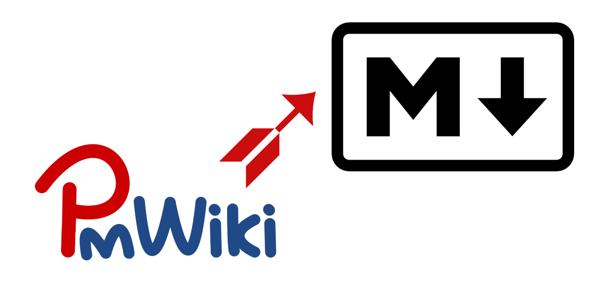

# PmDown - PmWiki to Markdown Converter

This is a tool for converting [PmWiki](https://www.pmwiki.org/) to Markdown format, and vice versa. A JavaScript version (for online or offline use in a browser), a Ruby version (for use on the command-line) and a VIM version (with more options) are available.

## Features

* Supports converting PmWiki to Markdown and Markdown to PmWiki
* Multilanguage localization support: English, Chinese (Traditional), and Chinese (Simplified)
  * Add other languages easily by translating the strings in `strings.js`

## Links

Other simple text converters:

* [X-SAMPA to IPA converter](https://github.com/dohliam/xsampa)
* [Markdown to Asciidoctor converter](https://github.com/dohliam/markdoctor)
* [Amharic to Latin text converter](https://github.com/dohliam/amharic-transliteration)
* [Cree syllabics to roman orthography converter](https://github.com/dohliam/cree-transliteration)

## Credits

* CSS: [skeleton-framework](https://github.com/skeleton-framework/skeleton-framework) via [dropin-minimal-css](https://github.com/dohliam/dropin-minimal-css)
* Application template: [simple-text-converter](https://github.com/dohliam/simple-text-converter)
* Localization: [simple-interface-translation](https://github.com/dohliam/simple-interface-translation)

## License

MIT.

